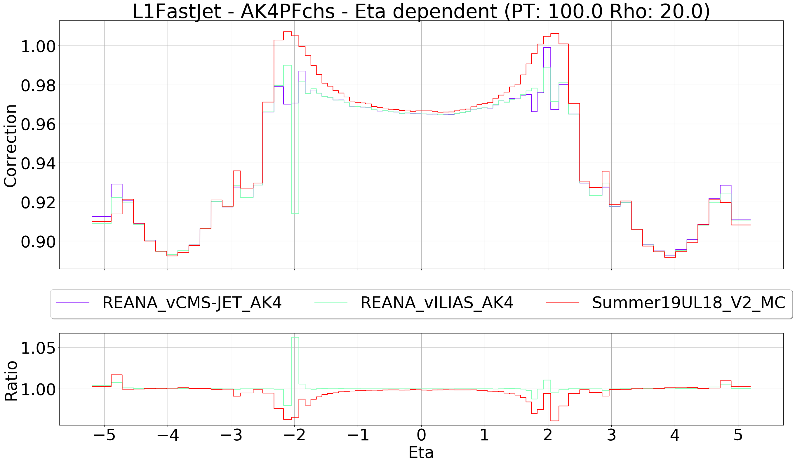

# Produce comparison plots between corrections

Credit to [FHead](https://github.com/FHead/FHead2011PhysicsProject/tree/master/JetEnergyCorrection/JetEnergyCorrection/21523_ExportJEC).

The script [Export.cpp](Export.cpp) applies JECs for any given level. The file [PlotComparisonVersions.py](PlotComparisonVersions.py) can then be used to plot the corrections.

## Setup environment

The scripts need some ROOT configurations to compile. While there migh be plenty ways to achieve this I make sure to be in a CMSSW environment

```console
$ cmsrel CMSSW_10_6_12
$ cd CMSSW_10_6_12/src
$ cmsenv
```

> IMPORTANT! You need to have a directory `JECDatabase/` in the same location as the scripts. Each correction text file has to reside in that directory. Let's say you have two versions called `REANA_vCMS-JET_AK4` and `REANA_vILIAS_AK4`, and you want to compare them using the `AK4PFchs` algorithm with `L1FastJet` and `L2Relative` levels. The directory `JECDatabase/` then has to look like

```console
$ ls -R JECDatabase
JECDatabase:
REANA_vCMS-JET_AK4      REANA_vILIAS_AK4

JECDatabase/REANA_vCMS-JET_AK4:
REANA_vCMS-JET_AK4_L1FastJet_AK4PFchs.txt
REANA_vCMS-JET_AK4_L2Relative_AK4PFchs.txt

JECDatabase/REANA_vILIAS_AK4:
REANA_vILIAS_AK4_L1FastJet_AK4PFchs.txt
REANA_vILIAS_AK4_L2Relative_AK4PFchs.txt
```

> This is not necessary if you are comparing versions that are being downloaded from GitHub. If so simply provide the official version name as stated on Github, and the script will execute it for you. Let's say you want to compare the [Summer19UL18_V2_MC](https://github.com/cms-jet/JECDatabase/tree/master/textFiles/Summer19UL18_V2_MC) corrections found on GitHub. Make sure to add `Summer19UL18_V2_MC` to [makePlots.sh](makePlots.sh) as described in the steps below. (The structure of the name is chosen to equal what is used in the official GitHub repository of [cms-jet/JECDatabase](https://github.com/cms-jet/JECDatabase/tree/master/textFiles)).

## Compile the code

To compile the scripts, simply run

```
$ make all
```

## Run the code

1. First configure [makePlots.sh](makePlots.sh).

```bash
ERA='REANA_vCMS-JET_AK4'
VERSIONS='REANA_vILIAS_AK4 Summer19UL18_V2_MC'
ALGO='AK4PFchs'
LEVELS='L1FastJet L2Relative'
DEPENDENT='all PT Eta Rho'
FIX_PT='100' #'30 100 300'
FIX_RHO='20' #'20 40 60'
FIX_ETA='0' # '1.5 2.3 3.0'
OUTPUT_PATH='/eos/user/a/adlintul/www/plots/JEC/Ilias-patch/16_11_2020'
```

* `ERA` is the name of the main correction
* `VERSIONS` are the names of the corrections you want to compare `ERA` with
* `ALGO` is name of jet algorithm, e.g. `AK8PF`, `AK8PFchs`, `AK8PUPPI`
* `LEVELS` are the correction levels
* `DEPENDENT` are the parameters to compute correction dependent plots of. Can be `all`, `PT`, `Eta` or `Rho`
* `FIX_PT` are the pT values to keep fixed when computing rho and eta dependent corrections
* `FIX_RHO` are the rho values to keep fixed when computing pT and eta dependent corrections
* `FIX_ETA` are the eta values to keep fixed when computing rho and pT dependent corrections
* `OUTPUT_PATH` is the location where to save the plots

2. Run the script

```
$ source makePlots.sh
```

Example output:

```console
INFO | Writing to "."
INFO | Downloading corrections from Github..
INFO | REANA_vCMS-JET_AK4_L1FastJet_AK4PFchs.txt already exist in JECDatabase/REANA_vCMS-JET_AK4
INFO | REANA_vILIAS_AK4_L1FastJet_AK4PFchs.txt already exist in JECDatabase/REANA_vILIAS_AK4
INFO | Downloading https://raw.githubusercontent.com/cms-jet/JECDatabase/master/textFiles/Summer19UL18_V2_MC/Summer19UL18_V2_MC_L1FastJet_AK4PFchs.txt into JECDatabase/Summer19UL18_V2_MC

INFO | Computing Eta dependent comparisons..
    PT 100
      Rho 20
         Level L1FastJet
INFO | Plotting comparison plots with Eta dependent
INFO | Plotting version REANA_vCMS-JET_AK4
INFO | Plotting version REANA_vILIAS_AK4
INFO | Plotting version Summer19UL18_V2_MC
INFO | Saved correction plot as ./JECChart_Correction_REANA_vCMS-JET_AK4_L1FastJet_AK4PFchs_EtaDependent_PT100.0_Rho20.0.png
```


